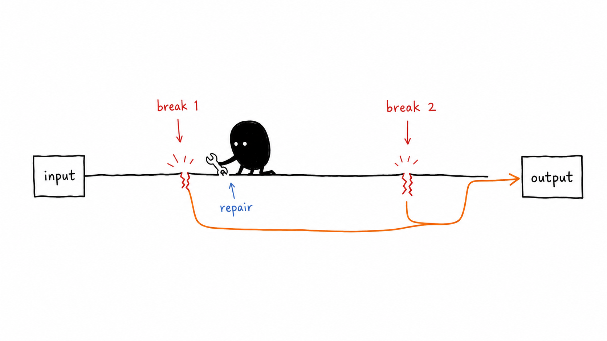
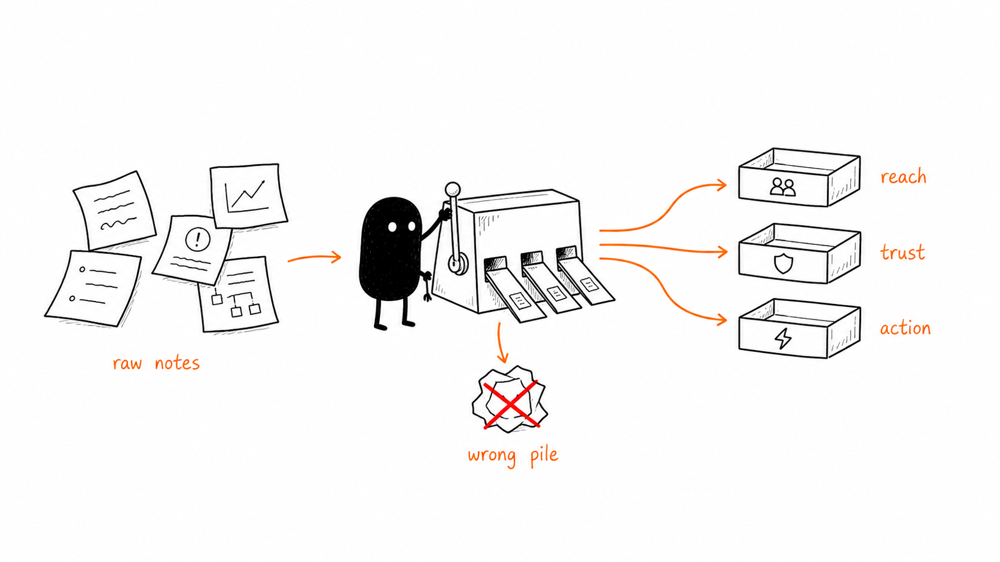
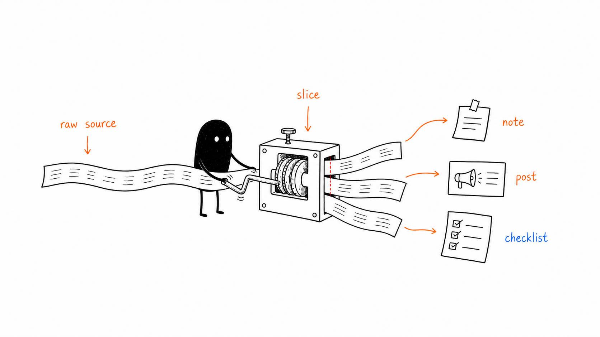
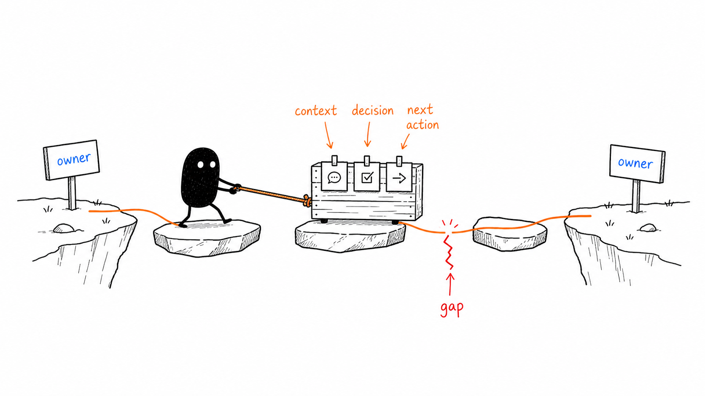
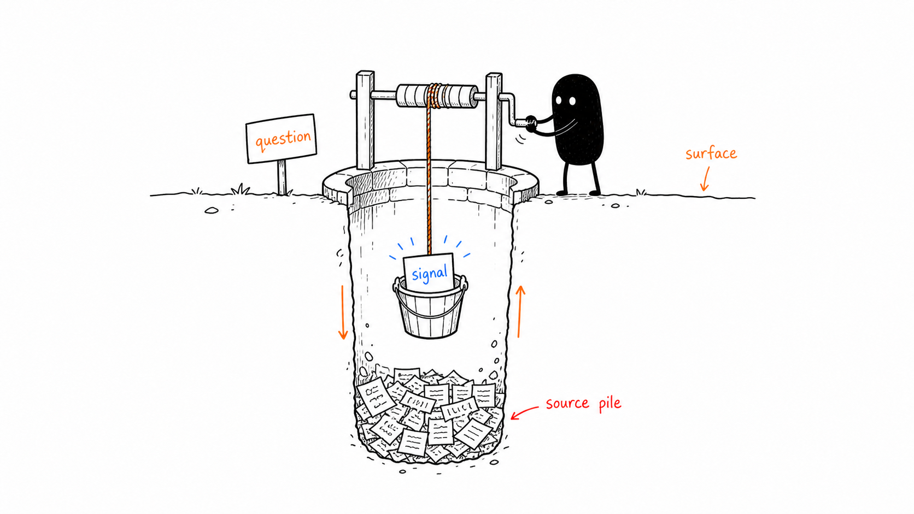
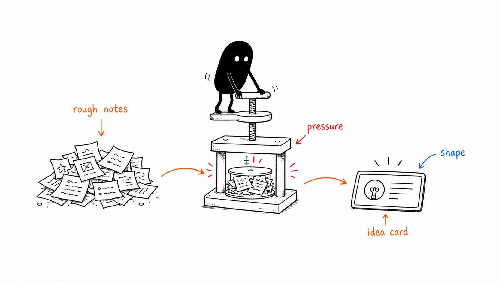
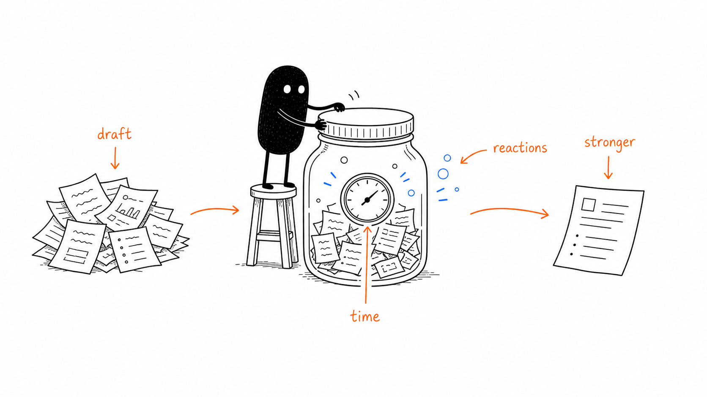
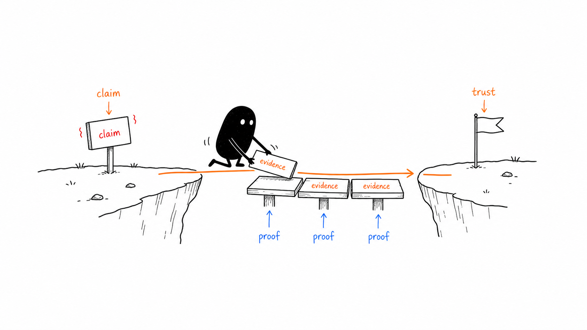

# Illustrations to Explain Things

> Turn judgments, flows, states, and metaphors from an article into memorable white-background hand-drawn explainer illustrations.
>
> 16:9 landscape | Xiaohei character | pure white hand-drawn line art | sparse red/orange/blue handwritten labels | agent skill

---

## What this repository is

`illustrations-to-explain-things` is an English adaptation of Ian's `ian-xiaohei-illustrations` skill. It helps an AI agent read an article, post, blog draft, Notion page, or methodology write-up, then turn one key idea at a time into a clean, absurd, hand-drawn article illustration.

This is not a generic illustration prompt pack and not a PPT infographic template. The goal is to understand the article's cognitive anchors first, then draw one judgment, process, structure, state, or metaphor as a memorable 16:9 explainer image.

The default recurring character is **Xiaohei**: a small solid-black figure with white dot eyes, tiny legs, and a blank serious expression. Xiaohei is not a mascot or decoration. Xiaohei should be doing the strange work that makes the system make sense.

This adaptation defaults to **English response text and English handwritten labels** unless the user explicitly asks for another language.

---

## Best fit

Especially useful for people who:

- write articles and want inline illustrations, not slide decks
- publish knowledge-heavy, workflow-heavy, or methodology-heavy content
- want to turn abstract reasoning into concrete metaphors
- want something lighter, stranger, and more distinctive than standard infographics
- want a reusable visual language for agent-assisted content production

Less suitable for people who want:

- polished commercial illustration or brand key visuals
- formal PPT infographics, detailed architecture diagrams, or classic flowcharts
- cute mascot art or children's-cartoon styling
- dense text-heavy teaching posters
- strictly editable vector source files

---

## What it produces

Default outputs:

- 16:9 landscape article illustrations
- a 4-8 image shot list for a single article
- per-image guidance for theme, core idea, structure type, Xiaohei action, and label suggestions
- final PNG files saved to `assets/<article-slug>-illustrations/` in the workspace when applicable

By default it does **not** produce:

- PPTX / PDF / Keynote
- editable SVG / HTML / Canvas output
- commercial posters or cover key visuals
- dense text infographics

---

## Visual style

The default style stays close to Ian's original Xiaohei article-illustration language:

- pure white background, with no paper texture, beige tint, gradients, or shadows
- black hand-drawn line art with light wobble
- lots of whitespace, with the main subject using about 40%-60% of the canvas
- sparse red, orange, and blue handwritten labels
- one illustration per core action, structure, state, or metaphor
- Xiaohei must participate in the central action
- strange, inventive, and clean, but never childish or cute

---

## Example gallery

### Two Breakpoints



### Sort by Purpose



### One Input, Many Outputs



### Handoff Path



### Information Well



### Idea Press



### Content Fermentation



### Trust Bridge



These images are preserved from Ian's original repository as style-calibration samples. They still contain the original handwritten Chinese annotations. In this English adaptation, newly generated outputs should default to English unless the user asks for another language.

---

## Installation

### As a skill

```bash
npx skills add https://github.com/diegopetrucci/illustrations-to-explain-things --skill illustrations-to-explain-things
```

Then use it in your agent:

```text
Use $illustrations-to-explain-things to plan and generate 5 article illustrations for this draft. Default to English labels.
```

### Local development checkout

```bash
git clone https://github.com/diegopetrucci/illustrations-to-explain-things.git
cd illustrations-to-explain-things
```

This repository also includes `.claude-plugin/plugin.json` and `.codex-plugin/plugin.json` so it can be packaged by plugin-compatible marketplaces.

---

## Usage

### Illustration planning only

```text
Use $illustrations-to-explain-things, but do not generate images yet.
Analyze the article below and propose a shot list of about 5 illustrations.
For each one, include:
- where it should appear
- the theme
- the core idea
- the structure type
- what Xiaohei is doing
- suggested elements
- suggested handwritten labels in English

<paste article>
```

### Generate article illustrations directly

```text
Use $illustrations-to-explain-things to generate 4 article illustrations for the piece below.
Requirements: 16:9 landscape, pure white background, black hand-drawn line art, sparse red/orange/blue handwritten labels in English.

<paste article>
```

### Generate one image for a single concept

```text
Use $illustrations-to-explain-things to create one article illustration for:
"Trust is not claimed out loud; it is laid down piece by piece through evidence."
Make it strange but clean, and make Xiaohei perform the core action.
```

### Remove a title or incorrect text from an image

```text
Use $illustrations-to-explain-things to edit this image.
Remove the top-left title "Flowchart" and keep everything else unchanged.
```

More examples live in [examples/prompts.md](examples/prompts.md).

---

## Workflow

The skill follows this flow:

1. Read the article, Markdown, Notion page, screenshot, or user-provided topic.
2. Extract the core claims, turning points, process structure, and paragraphs that truly benefit from illustration.
3. Output a shot list first, with one cognitive anchor per image.
4. Pick a structure type for each image: workflow, system slice, before/after, role state, concept metaphor, method layers, route map, or comic beats.
5. Invent a fresh low-tech physical metaphor for the current article.
6. Make Xiaohei perform the core action.
7. Generate each image separately with the image model.
8. Check the result against the QA checklist: white background, whitespace, Xiaohei participation, English labels by default, non-PPT feel, and no copy of old compositions.
9. Save the final PNGs and report their purpose and paths.

---

## Repository structure

```text
.
├── .claude-plugin/
│   └── plugin.json
├── .codex-plugin/
│   └── plugin.json
├── README.md
├── LICENSE
├── NOTICE.md
├── assets/
│   └── ian-wechat-qr.jpg
├── examples/
│   ├── images/
│   │   ├── 01-two-breakpoints.png
│   │   ├── 02-sort-by-purpose.png
│   │   └── ...
│   └── prompts.md
└── skills/
    └── illustrations-to-explain-things/
        ├── SKILL.md
        ├── agents/
        │   └── openai.yaml
        ├── assets/
        │   └── examples/
        └── references/
            ├── style-dna.md
            ├── xiaohei-ip.md
            ├── composition-patterns.md
            ├── prompt-template.md
            └── qa-checklist.md
```

The installable skill lives at:

```text
skills/illustrations-to-explain-things/
```

The root README, LICENSE, NOTICE, and examples remain GitHub-facing documentation and attribution material.

---

## Notes

- Short handwritten labels are more reliable than long text.
- One image should explain one core structure, not an entire lesson page.
- If the image still works after removing Xiaohei, Xiaohei is too decorative.
- Example images are only for line density, whitespace, color restraint, and Xiaohei participation. Do not copy their composition.
- Image models can still produce typos, stray labels, style drift, or unnecessary titles. Inspect the output after generation.
- If label quality is weak, reduce the number of labels and regenerate.

---

## Attribution and source material

This repository is an independent repository, not a fork. It was adapted from Ian's original source repository:

- Original repo: <https://github.com/helloianneo/ian-xiaohei-illustrations>
- Original author: Ian
- License: MIT, preserved in [LICENSE](LICENSE)
- Attribution notice: preserved and expanded in [NOTICE.md](NOTICE.md)

Bundled example images remain Ian's original calibration samples and are kept here with attribution.

Related Ian projects:

- [Ian Handdrawn PPT](https://github.com/helloianneo/ian-handdrawn-ppt)
- [Awesome Claude Code Skills](https://github.com/helloianneo/awesome-claude-code-skills)
- [Obsidian + Claude AI Second Brain](https://github.com/helloianneo/obsidian-ai-second-brain)

Author links:

- GitHub: [helloianneo](https://github.com/helloianneo)
- Website: [www.ianneo.xyz](https://www.ianneo.xyz)
- X/Twitter: [@ianneo_ai](https://x.com/ianneo_ai)

---

## License

MIT License. See [LICENSE](LICENSE).
